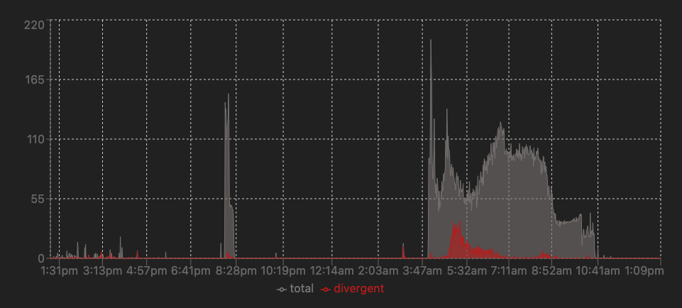
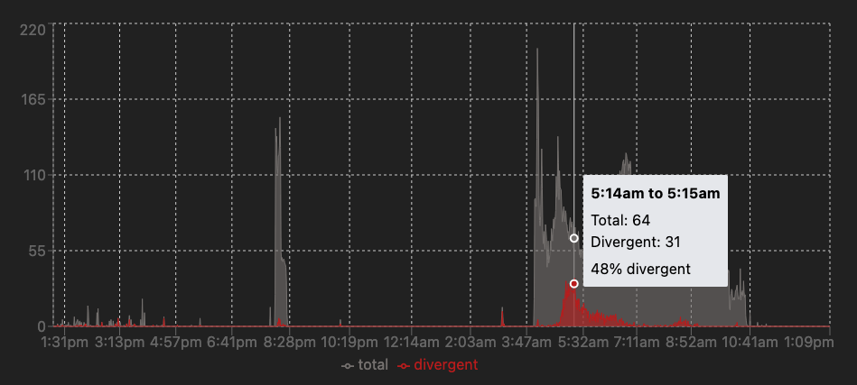
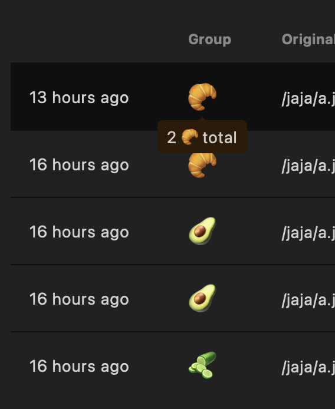
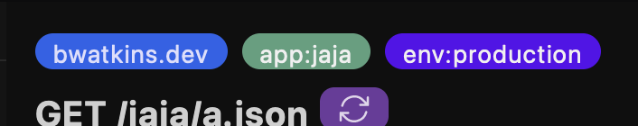
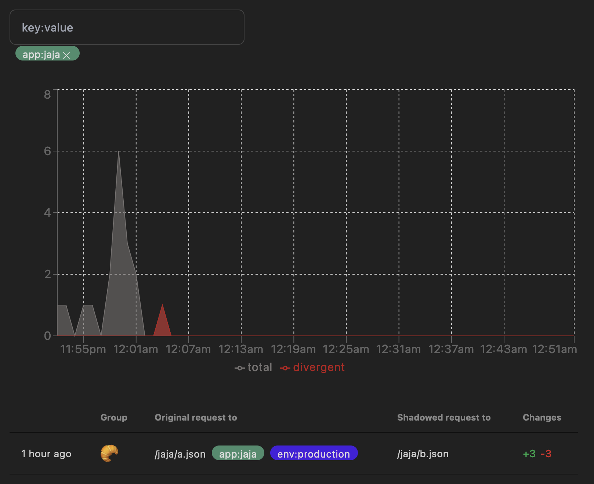
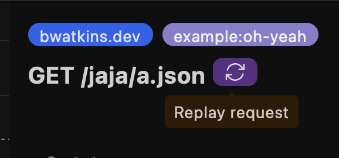
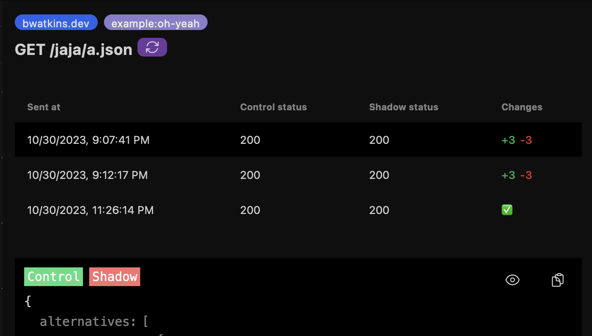
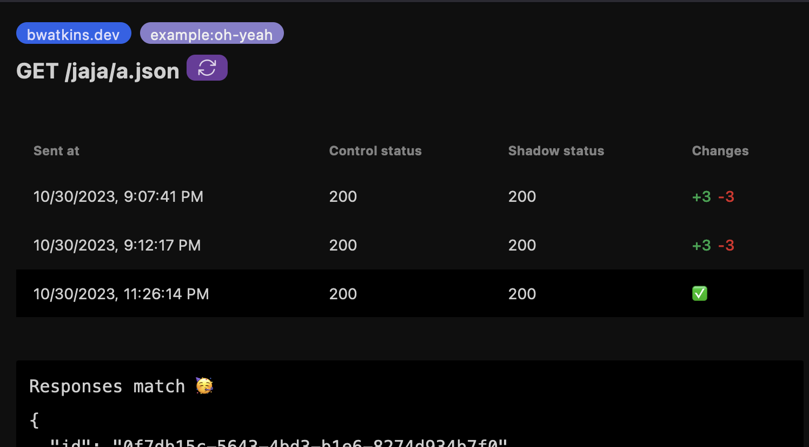
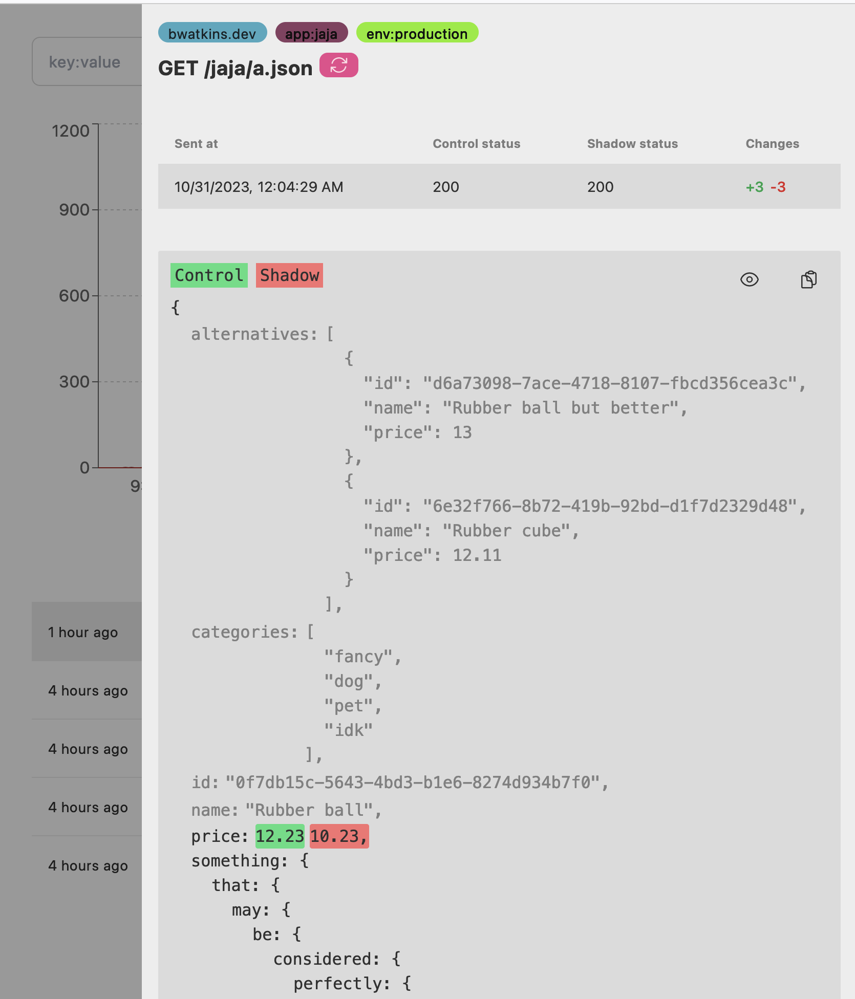

# Cloudflare request shadowing 🥷🚧

Transparently send requests from one URL to another with output comparison.

Test for API compatibility, of any size change, to HTTP endpoints without expensive manual testing or disrupting production traffic. This is intended to _complement_ automated testing
suites by bringing that extra few feet of confidence in changes.

For example, you are throwing in the towel on breathing life into an existing service with a rewrite. Shadow traffic from the old service to the new service to test compatibility. When you're no longer seeing unexpected divergences in responses, switch over traffic! (probably with flags/canaries to be safe)

https://github.com/OutdatedVersion/cloudflare-request-shadowing/assets/11138610/ce86df78-8534-4e19-99ae-601559a2f658

## Summary

- Little to no overhead 🤝
  - Shadowing occurs after the original request's response is sent back to the client--keeping your latency sensitive services happy
- Flexible configuration 🔨
  - Combine Workers' `routes` configuration and JavaScript
- [At-rest data encryption](#privacy--encryption-) 🔒
- [Replay requests](#replays-) 🔁
- [Automatic grouping](#automatic-grouping-) 🥅
- [Tagging](#tagging-) 🏷️
- [Export](#export-) 📦
- [Themed interface](#light-and-dark-themes) ☀️🌕
- [Sharable links (group work in mind)](#sharable-urls)

## 📋 / 📸

### First class JSON diffs 👀

Compare JSON responses without inconsequential diffs.

- Objects: Properties can be moved but their value cannot change
- Arrays: Entries cannot move or change value
  - Moves are tracked separately from deletions/additions

 
  
Screenshots 📸

https://github.com/OutdatedVersion/cloudflare-request-shadowing/assets/11138610/a4483a60-be60-4c94-91b8-2f169ec97368

### Aggregation 📈

Visualize divergence trends with aggregated data through the UI or API.

 
  
Screenshots 📸

### Automatic grouping 🥅

Quickly see what class of issue is happening most.

Groups are created for each unique set of divergent response keys. So, given:

- Response of shadow request A has 2 divergent keys `name` and `price`
- Response of shadow request B has 2 divergent keys `name` and `price`
- Response of shadow request C has 1 divergent key `name`
- Response of shadow request D has no divergent keys

We would have 2 groups:

- 🥐 Request A and B -- `name` and `price`
- 🥑 Request C -- `name`

Request D is not given a group or rendered on the page as it isn't divergent. It will be included
in the aggregation graph under "Total"s though.

 
  
Screenshots 📸

  

### Export 📦

Quickly export saved responses for use fixtures elsewhere.

 
  
Screenshots 📸

  

### Tagging 🏷️

Apply tags you can filter by using the UI or API. [Computed with JavaScript](https://github.com/OutdatedVersion/cloudflare-request-shadowing/blob/37499a0238ea72bd42e106a8572dffaeb91296ae/shadower/src/worker.ts#L323-L328), you
have the flexibility to create effective tags for your use-case.

 
  
Screenshots 📸

   

### Sharable URLs

We try to make anything intractable translate to the URL so you can easily share what you're seeing with coworkers.

### Privacy / encryption 🔑

Comfortably process requests knowing exactly what code is running with at-rest encryption\* of sensitive content. Especially useful in regulated environments.

- Control
  - Request headers 🔐
  - Response body 🔐
  - _Response headers are not saved_
- Shadows
  - Request URL 🚫
    - Though encrypted _in-transit_ by TLS, we consider URLs as low sensitivity content and save it in plain-text. Do not put sensitive content in URLs!
  - Request method 🚫
  - Request headers 🔐
  - Response body 🔐🚫
    - We save which paths diverge in plain-text for performant lists and grouping. Everything else is encrypted.
      - For example, if the control response and shadow response's `.name` properties diverge, `['name']` would be saved in plain-text while the full value is encrypted.
  - Response headers 🔐
  - Response status code 🚫
- Tags 🚫

See [schema](schema/src/lib.ts)/[table](./tables.sql) for a rough idea on data structure

\* Using a 256 bit AES-GCM key derived, from a secret of your choice, using PBKDF2. See [source code](encryption/src/lib.ts) for implementation.

### Replays 🔁

Systems can be complex and indeterminate. Replays allow you to resend
requests ad-hoc to help track down flaky mismatches.

Replays trigger a request to the same URL and headers that
triggered the original shadow. This triggers a shadow as usual
but the result will be saved to the shadow you _triggered the replay
from_ instead of creating a new one.

 
  
Screenshots 📸

   

### Light and dark themes

Supporting both people who like to actually read whats on their monitor with bright lights around and those who won't accept
anything but a dark mode (or to avoid late night *flash bang out*s)

Page theme follows system/browser theme

## Deployment 🚢

> [!NOTE]  
> You'll need to use Cloudflare as a reverse proxy[^1] to run this!

You are responsible for deploying and operating this tool. I'll do what I can
to answer questions and provide guides though. 🙂

There are 3 runtime components:

- `shadower`: Forwards original (aka control) requests, sends shadow request, compares responses, and saves output to database
- `api`: Pull records from database
  - Note: I had originally only separated this as Pages' Workers struggled with Node.js compatibility on (for `pg` module) which may no longer be the case. At this point, I like the boundary.
- `web`: Front-end to `api` rendering diffs (skip for bring-your-own-interface)

### How to

What to bring:

- Postgres server
  - Sizing is relative to expected load
    - Anecdotally: We've been running AWS' Aurora Serverless with 4 APU at 4/rps (20/rps burst) without breaking 25% database load.
- Cloudflare account

Steps:

1. Git clone or download project
2. Setup Cloudflare Access for the domain you'll host the web interface on
   - This will likely be `project-name.pages.dev` where `project-name` is in `deploy` of [these scripts](./web/package.json)
3. `npm ci`: Install setup script dependencies
4. `node setup.mjs`: Run setup script
   - Alternatively, do what [setup.mjs](./setup.mjs) is doing by hand
5. Adjust `getShadowingConfigForUrl` in [shadower](./shadower/src/worker.ts)
   - See option documentation under `ShadowingConfig` type
6. Adjust `routes` in [shadower wrangler.toml](./shadower/wrangler.toml)
7. Deploy shadower (`npm run deploy` in `shadower`)

<!--  -->

[^1]:
    Verify there is an "orange cloud" on the dashboard for the domain you intend to use. See
    [docs/orange-cloud.png](docs/orange-cloud.png).
