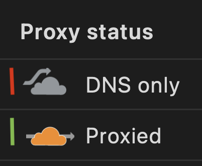

# Cloudflare request shadowing 🥷🚧

Transparently send requests from one URL to another.

- Little to no overhead 🚗💨
  - Shadowing occurs after the original request completes keeping your latency sensitive services happy
- Replay requests 🔁
- Automatic grouping 🥅
- Flexible configuration 🔨
  - Combine Workers' `routes` configuration and JavaScript to
- Tagging

> [!NOTE]  
> You'll need to use Cloudflare as a reverse proxy (orange cloud in the dashboard[^1]) to run this!

## 📋 / 📸

### First class JSON diffs 👀

### Export 📋

### Tagging

### Sharable URLs

We try to make anything intractable translate to your URL so you can easily share what you're seeing with coworkers.

### Privacy / encryption 🔑

Comfortably process requests knowing exactly what code is running with at-rest encryption\* of sensitive content. Especially useful in regulated environments.

- Control
  - Request headers 🔐
  - Response body 🔐
  - _Response headers are not saved_
- Shadows
  - Request URL 🚫
    - Though encrypted _in-transit_ by TLS, we consider URLs as low sensitivity content and save it in plain-text. Do not put sensitive content in URLs!
  - Request method 🚫
  - Request headers 🔐
  - Response body 🔐🚫
    - We save which paths diverge in plain-text for performant lists and grouping. Everything else is encrypted.
      - For example, if the control response and shadow response's `.name` properties diverge, `['name']` would be saved in plain-text while the full value is encrypted.
  - Response headers 🔐
  - Response status code 🚫
- Tags 🚫

See [schema](api/src/schema.ts) as aggregation point on how data is saved

\* Using a 256 bit AES-GCM key derived, from a secret of your choice, using PBKDF2. See [source code](encryption/src/lib.ts) for implementation.

### Replays 🔁

Systems can be complex and indeterminate. Replays allow you to resend
requests ad-hoc to help track down flaky mismatches.

Replays trigger a request to the same URL and headers that
triggered the original shadow. This triggers a shadow as usual
but the result will be saved to the shadow you _triggered the replay
from_ instead of creating a new one.

### Light and dark themes

Supporting both people who like to actually read whats on their monitor with bright lights around and those who won't accept
anything but a dark mode (or to avoid late night *flash bang out*s)

^1: 
