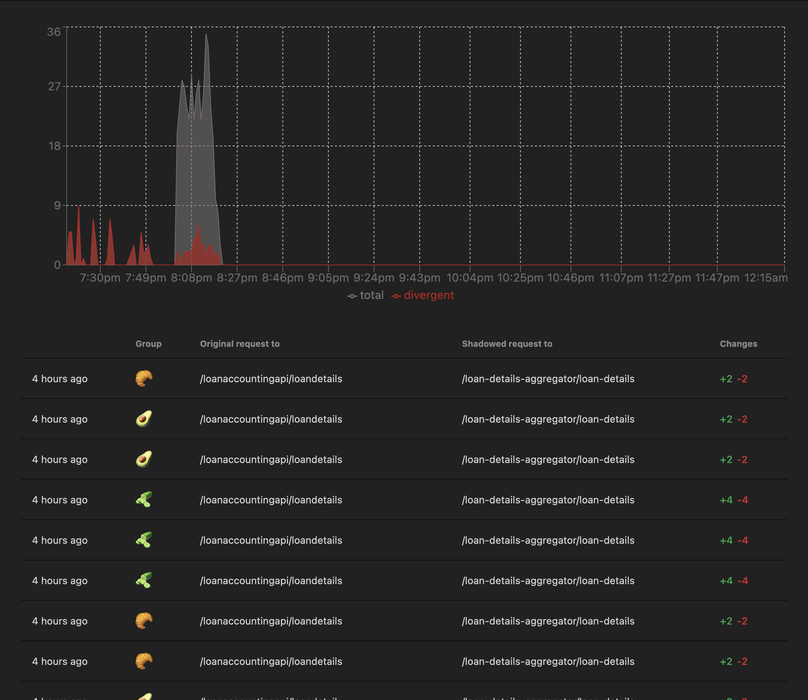
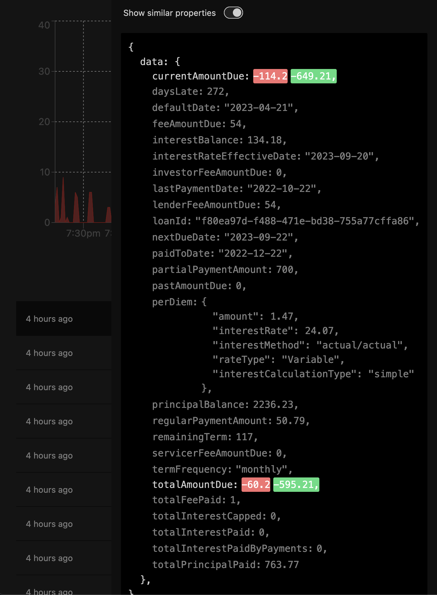
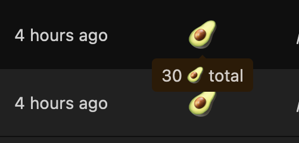

# Cloudflare request shadowing

Transparently send a request coming in on one URL
to another URL then compare their responses.

Shadowing requests improves confidence in new code allowing less
stressful mainline production releases.

This can be especially useful in organizations without
mature automated testing suites.

## Screenshots 📸

First class JSON diffing

Grouping

